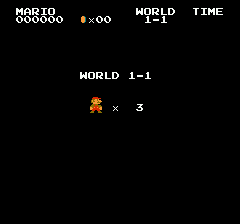
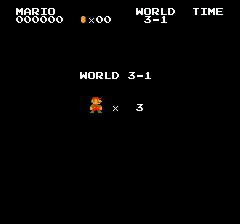

# MariHA - Mario Human Alignment Benchmark (Status: WiP - untested)

> 🎵 Mario-hii Mario-huu Mario-hoo Mario ah haaaa! 🎵
>
> — An exhausted data manager.

**Built upon [COOM (Continual Doom)](https://github.com/TTomilin/COOM)** - This project is based on the [COOM](https://arxiv.org/abs/2303.13002) benchmark by Tristan Tomilin et al. (NeurIPS 2023). We extend their excellent continual reinforcement learning framework to create MariHA, a benchmark for evaluating human-AI alignment in game-based environments.


In MariHA, agents are trained on a human-derived curriculum — a sequence of short gameplay clips recorded from real players — and must progressively learn to clear scenes that the human subjects encountered during their sessions. The benchmark measures not only raw performance but also how well agents *retain* past skills and *transfer* knowledge to new scenes.


📄 **Paper**: [MariHA on OpenReview](https://openreview.net/forum?id=YAVB439L9X)

<p align="center">
  
  
</p>

---

## Overview

| Property | Value |
|----------|-------|
| Observation space | `(84, 84, 4)` grayscale frame-stack, normalised to `[0, 1]` |
| Action space | Discrete (9 actions) |
| Scenes | 313 unique scenes across 32 levels |
| Subjects | 5 (sub-01, 02, 03, 05, 06) |
| Task structure | Sequential curriculum derived from human play sessions |
| Reward | Δ X-position per step |
| Termination | Scene cleared (exit reached), death, or frame budget exhausted |

---

## Setup

```bash
bash setup.sh
source env/bin/activate
```

`setup.sh` creates a Python 3.9+ virtual environment, installs all dependencies, and generates the per-scene scenario files. Subject data (`.state` files) is stored in `data/mario.scenes` via git-annex:

```bash
# Pull data for all subjects
cd data/mario.scenes && git annex get sub-*/
```

---

## Quickstart

### Train (full CL curriculum)

Agent and CL strategy are selected independently:

```bash
# Vanilla agents (no continual-learning method)
mariha-run-cl --agent sac --subject sub-01 --seed 0
mariha-run-cl --agent ppo --subject sub-01 --seed 0
mariha-run-cl --agent dqn --subject sub-01 --seed 0

# Compose any CL method on top of any agent
mariha-run-cl --agent sac --cl_method ewc --subject sub-01 --seed 0
mariha-run-cl --agent ppo --cl_method packnet --subject sub-01 --seed 0
mariha-run-cl --agent dqn --cl_method der --subject sub-01 --seed 0
```

Pass `--render_every N` to open a live window every N episodes and watch the agent play in real time. Pair it with `--render_speed S` to slow down or speed up the playback (1.0 = 60 fps, 0.5 = 30 fps, 10 = up to 600 fps best-effort):

```bash
mariha-run-cl --agent sac --cl_method ewc --subject sub-01 --seed 0 --render_every 100 --render_speed 0.5
```

### Train (single scene, for debugging)

`mariha-run-single` mirrors `mariha-run-cl`'s registry pattern, so any registered agent works:

```bash
mariha-run-single --agent sac --scene_id w1l1s0 --seed 0
mariha-run-single --agent ppo --scene_id w1l1s0 --seed 0
mariha-run-single --agent dqn --scene_id w1l1s0 --seed 0
```

Pass `--render_every N` to open a live window every N episodes and watch the agent play in real time. Use `--render_speed S` to adjust playback speed (default `1.0` = 60 fps):

```bash
mariha-run-single --agent sac --scene_id w1l1s0 --seed 0 --render_every 10 --render_speed 0.5
```

### Evaluate

```bash
mariha-evaluate \
  --subject sub-01 \
  --agent sac \
  --cl_method ewc \
  --run_prefix <timestamp_seed0> \
  --n_episodes 5 \
  --eval_diagonal          # adds BWT / forgetting metrics
```

Outputs `experiments/sub-01/sac_ewc/<run_prefix>/eval_results.json`.

---

## Agents and CL methods

Agent and continual-learning method are selected independently:
``--agent`` picks the RL algorithm, ``--cl_method`` (optional) picks the
CL strategy that is composed on top of it.

### Agents (`--agent`)

| Name | Class | Description |
|------|-------|-------------|
| `sac` | `SAC` | Discrete-action Soft Actor-Critic |
| `ppo` | `PPO` | Proximal Policy Optimization (on-policy) |
| `dqn` | `DQN` | Deep Q-Network (epsilon-greedy) |
| `ddqn` | `DQN` | Double DQN (alias for `dqn` with `--double_dqn=True`) |
| `random` | `RandomAgent` | Random-action baseline |

### CL methods (`--cl_method`)

Omit ``--cl_method`` to fine-tune sequentially with no CL strategy.

| Name | Class | Description |
|------|-------|-------------|
| `l2` | `L2Regularizer` | L2 anchor (uniform importance) |
| `ewc` | `EWC` | Elastic Weight Consolidation (Fisher diagonal) |
| `mas` | `MAS` | Memory Aware Synapses (output sensitivity) |
| `si` | `SI` | Synaptic Intelligence (online surrogate) |
| `packnet` | `PackNet` | Iterative magnitude pruning and freezing |
| `agem` | `AGEM` | Averaged Gradient Episodic Memory (gradient projection) |
| `der` | `DER` | Dark Experience Replay (actor / Q-value distillation) |
| `clonex` | `ClonEx` | DER + critic distillation |
| `multitask` | `MultiTask` | Joint training upper bound (shared replay) |

Every CL method works with every RL agent through the agent-agnostic
hooks (``get_named_parameter_groups``, ``forward_for_importance``,
``distill_targets``).  Example: ``mariha-run-cl --agent dqn --cl_method ewc``.

---

## Metrics

| Metric | Description |
|--------|-------------|
| **AP** | Average Performance across all scenes with the final model |
| **BWT** | Backward Transfer — how much final performance differs from peak performance per task (negative = forgetting) |
| **Forgetting** | `max(0, −BWT)` |
| **Plasticity** | Performance on the last task only |
| **clear_rate** | Fraction of episodes where Mario reached the exit |
| **mean_x_traveled** | Mean X-distance per episode |
| **mean_score_gained** | Mean score delta per episode |
| **death_rate** | Fraction of episodes ending in death |

---

## Project Structure

```
MariHA/
├── mariha/
│   ├── curriculum/    # EpisodeSpec, HumanSequence loader
│   ├── env/           # MarioEnv, SceneEnv, ContinualLearningEnv, wrappers
│   ├── replay/        # FIFO, Reservoir, PER, EpisodicMemory, Rollout buffers
│   ├── rl/            # SAC, PPO, DQN training loops + network architectures
│   ├── methods/       # CL methods composed on any agent
│   └── eval/          # CL metrics, eval runner
├── scripts/
│   ├── run_cl.py      # Full CL training (mariha-run-cl)
│   ├── run_single.py  # Single-scene training (mariha-run-single)
│   └── evaluate.py    # Evaluation (mariha-evaluate)
├── data/
│   ├── mario/         # Game integration + stimuli (bundled)
│   └── mario.scenes/  # Human gameplay data (git-annex)
├── setup.sh
└── pyproject.toml
```

---

## Key Design Choices

**Human-aligned curriculum.** Each episode uses the exact emulator state (`.state`) from a human player's clip, placing the agent at the same starting position with the same game state. This grounds the benchmark in real human play rather than arbitrary level resets.

**Two-input architecture.** The actor and critic take the pixel observation `(84, 84, 4)` and the task one-hot vector as *separate* inputs. The CNN processes pixels; the task ID conditions the dense trunk. This follows the [COOM](https://arxiv.org/abs/2303.13002) convention and enables multi-head outputs for task-specific policies.

**Episode-driven loop.** Training consumes one `EpisodeSpec` per episode from the curriculum until exhausted, rather than a fixed step budget. This preserves the human-aligned timing of each clip.

**Same scenes for eval.** Evaluation uses the first clip per scene from the training curriculum as the canonical eval episode, enabling direct comparison of training-time performance vs. final-checkpoint performance.

---

## Inspired by and built upon COOM

From COOM, MariHA inherits:

- The discrete-action SAC implementation and two-input `(obs, task_one_hot)` architecture
- The conceptual catalogue of CL baselines (`l2`, `ewc`, `mas`, `agem`, `packnet`, `der`, `clonex`)
- The `fifo` / `reservoir` / `priority` / `per` replay buffer stack

MariHA extends COOM with:

- **Human-aligned curriculum**: episodes are derived from real human gameplay recordings (6 subjects, 313 scenes, ~5 k clips), rather than procedurally generated levels
- **NES Super Mario Bros environment**: `stable-retro` integration replacing the ViZDoom stack
- **Agent-agnostic CL composition**: every CL method runs on any RL agent (SAC, PPO, DQN) via shared hooks, instead of inheriting from a SAC-only base class
- **Additional baselines and agents**: `si`, `multitask`, plus PPO and DQN agents alongside SAC
- **Evaluation suite**: CL performance matrix (AP, BWT, forgetting, plasticity) + behavioral metrics (`clear_rate`, `mean_x_traveled`, `death_rate`) computed from the same scenes used during training

```bibtex
@inproceedings{tomilin2023coom,
  title     = {{COOM}: A Game Benchmark for Continual Reinforcement Learning},
  author    = {Tomilin, Tristan and Fang, Meng and Zhang, Yudi and Pechenizkiy, Mykola},
  booktitle = {Advances in Neural Information Processing Systems (NeurIPS)},
  year      = {2023},
  url       = {https://arxiv.org/abs/2303.13002},
}
```

---

## Running on Compute Canada (Narval)

Two workflows are supported. Both share the same `MARIHA_DATA_ROOT` mechanism
for keeping data on `$SCRATCH` and the repo on `$HOME`.

### `MARIHA_DATA_ROOT` — separating repo and data

By default MariHA looks for `data/` inside the repo. If your data lives
elsewhere (e.g. `$SCRATCH/MariHA/data`), set:

```bash
export MARIHA_DATA_ROOT=$SCRATCH/MariHA/data
```

This can go in your `~/.bashrc` or at the top of your SLURM job script.
Without it the code falls back to `<repo>/data/` as before.

---

### Option A — Plain venv (no apptainer, recommended)

**One-time setup** (login node):

```bash
# Clone repo to $HOME (keep the repo out of $SCRATCH — lustre causes issues)
cd $HOME/GitHub
git clone <repo-url> MariHA
cd MariHA

# Run CC-specific setup (loads modules, clones stable-retro,
# creates venv, installs MariHA, generates scenario files)
bash setup_cc.sh
```

By default `setup_cc.sh` expects data at `$SCRATCH/MariHA/data`. If your data
lives somewhere else, just export the variable before running:

```bash
export MARIHA_DATA_ROOT=/path/to/your/data
bash setup_cc.sh
```

**Pull data** (if not already done):

The `mario.scenes` dataset is a git-annex repo. Clone it under your data root
and pull the subject state files:

```bash
cd $SCRATCH/MariHA/data/mario.scenes && git annex get sub-*/
```

**Submit a job**:

Edit `scripts/narval_sac_cl_venv.sh` with your SLURM account, then from the
repo root:

```bash
mkdir -p logs
sbatch scripts/narval_sac_cl_venv.sh
```

---

### Option B — Apptainer container

**One-time setup** (login node):

```bash
module load StdEnv/2023 apptainer/1.4.5
export APPTAINER_CACHEDIR=$SCRATCH/.apptainer_cache
apptainer pull --dir $SCRATCH docker://cleode5a7/mariha-gpu:latest
mv $SCRATCH/mariha-gpu_latest.sif $SCRATCH/mariha-gpu.sif

cd $SCRATCH
git clone <repo-url> MariHA
cd MariHA/data/mario.scenes && git annex get sub-*/
```

**Submit a job**:

Edit `scripts/narval_test_sac_cl.sh` with your SLURM account, then:

```bash
sbatch scripts/narval_test_sac_cl.sh
```

The script passes `MARIHA_DATA_ROOT` into the container via `--env`. When the
repo and data are co-located under `$SCRATCH/MariHA/` the default works without
any changes.

**Rebuilding the image** (after adding a dependency):

```bash
# On your local Linux machine
docker build -t mariha-gpu .
docker tag mariha-gpu cleode5a7/mariha-gpu
docker push cleode5a7/mariha-gpu

# On Narval: re-pull
rm $SCRATCH/mariha-gpu.sif
export APPTAINER_CACHEDIR=$SCRATCH/.apptainer_cache
apptainer pull --dir $SCRATCH docker://cleode5a7/mariha-gpu:latest
mv $SCRATCH/mariha-gpu_latest.sif $SCRATCH/mariha-gpu.sif
```

The `Dockerfile` is at the repo root. Key design choices:
- Base image: `nvidia/cuda:12.5.1-devel-ubuntu22.04` (system CUDA, compatible with `--nv`)
- cuDNN: installed via `nvidia-cudnn-cu12>=9.3,<9.4` pip package to match TF 2.21's build
- `LD_LIBRARY_PATH` in the image points to the pip cuDNN so TF finds the right version

---

## Requirements

- Python 3.9+
- TensorFlow 2.13+ (tested on 2.21; `tf_keras` is installed automatically for Keras 3 compatibility)
- stable-retro 0.9.2+
- The `mario.scenes` dataset (git-annex)

---

## Citation

If you use MariHA in your research, please cite:

```bibtex
@misc{mariha2026,
  title   = {MariHA: A Continual Reinforcement Learning Benchmark for Human-AI Alignment on Super Mario Bros},
  year    = {2026},
}
```
